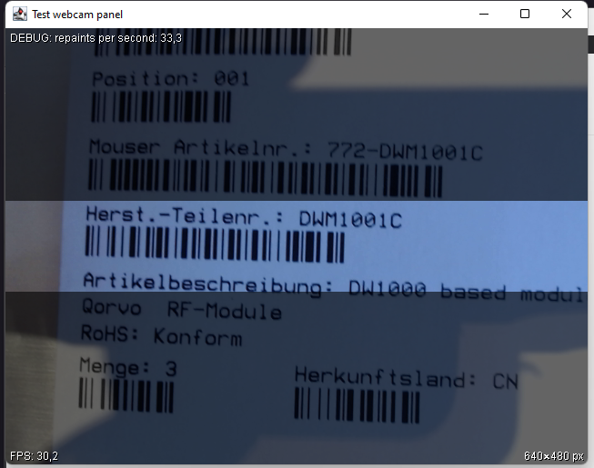

# WebcamBarcodeScanner

The WebcamBarcodeScanner opens the computer's webcam and tries to scan barcodes. Every time a barcode is found, the text is typed using keyboard emulation. Barcodes are only scanned in the highlighted area of the image so that you can scan a specific barcode even if multiple codes are present in the image.

